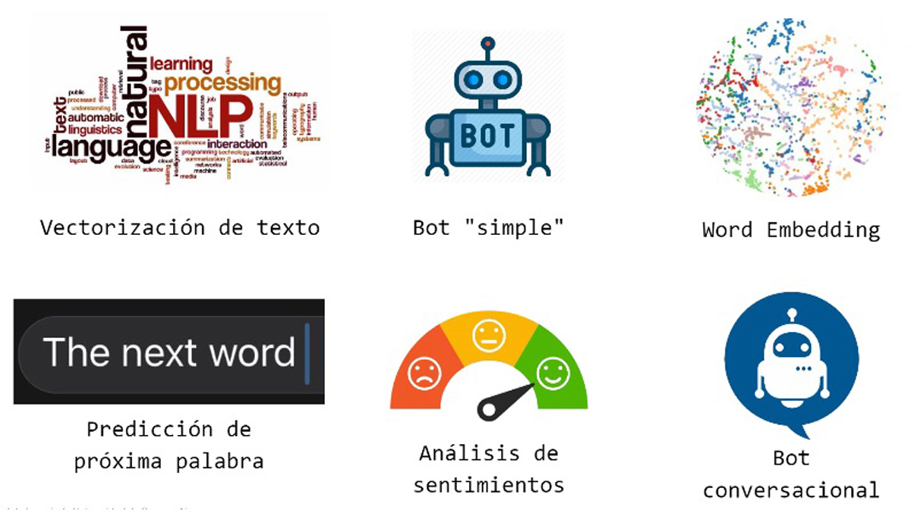

# AI NLP-Projects

Natural lenguage processig AI-Specialization - UBA (Universidad Nacional de Buenos Aires)
\
\

## Vectorización de texto
Colab: [word 2 vec](https://github.com/Pbrillan/CEIA/blob/main/NLP/P_Brillanti_1a_word2vec_Modificado.ipynb)

## Bot Simple

Rule based bot with DNN + Spacy..\
Colab: [bot_dnn_spacy_esp](https://github.com/Pbrillan/CEIA/blob/main/NLP/Pbrillan_2b_bot_dnn_spacy_esp.ipynb)

## Word Embedding
The goal is to use documents / corpus to create word embeddings based on that context. Band songs will be used to generate the embeddings, that is, the vectors will have the shape depending on how that band has used the words in their songs.\
Colab: [Custom_embedding_con_Gensim](https://github.com/Pbrillan/CEIA/blob/main/NLP/Pbrillan_3b_Custom_embedding_con_Gensim.ipynb)

## Predicción de proxima palabra
The goal is to use documents / corpus to create word embeddings based on that context using the Keras Embedding layer. These embeddings will be used together with LSTM layers to predict the next possible word.\
Colab: [predicción_palabra](https://github.com/Pbrillan/CEIA/blob/main/NLP/Pbrillan_4d_predicci%C3%B3n_palabra.ipynb)

## Análisis de sentimientos
Sentiment analysis con Embeddings + LSTM.\
Colab: [clothing_ecommerce_reviews](https://github.com/Pbrillan/CEIA/blob/main/NLP/Pbrillan_5d_clothing_ecommerce_reviews.ipynb)

## Bot Conversacional
LSTM Bot QA.\
Colab: [bot_qa](https://github.com/Pbrillan/CEIA/blob/main/NLP/Pbrillan_6d_bot_qa.ipynb)

# Thanks!
Feel free to contact me by mail _pablobrillanti@gmail.com_ for any doubt.\
Enjoy :smile:!!
